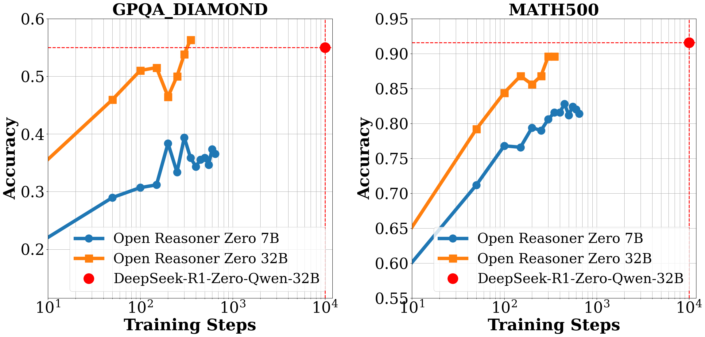
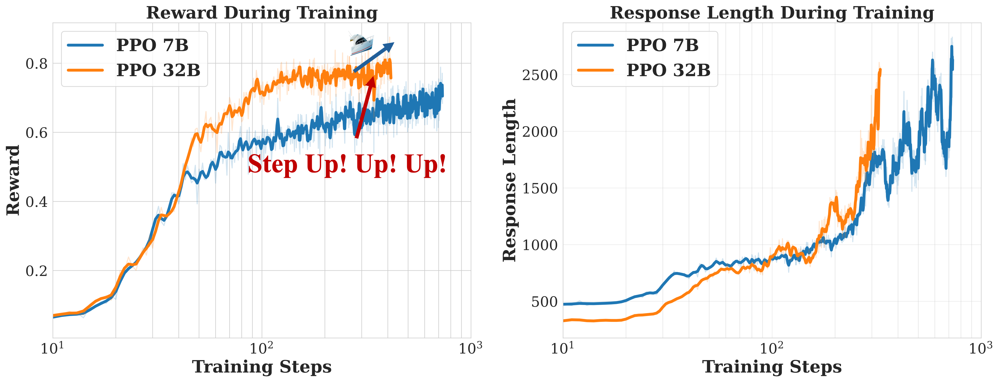

<div align="center">

# Open Reasoner Zero


<div>
<!-- I want to use a tide emoji here -->

An Open Source Approach to Scaling Up Reinforcement Learning on the Base Model
</div>
</div>

<div align="center" style="line-height: 1;">
    <a href="https://github.com/Open-Reasoner-Zero/Open-Reasoner-Zero" style="margin: 2px;"></a>
  
  <a href="https://huggingface.co/Open-Reasoner-Zero" target="_blank"></a>

  <a href="https://yasminezhang.notion.site/Open-Reasoner-Zero-19e12cf72d418007b9cdebf44b0e7903" target="_blank">
  </a>

  <br>
  <a href="https://github.com/Open-Reasoner-Zero/Open-Reasoner-Zero/blob/main/ORZ_paper.pdf"><b>Paper PDF Link [WIP]</b>👁️</a>
</div>

<div>
<br>

</div>



*Figure 1 | Evaluation performance of Open-Reasoner-Zero-\{7B, 32B\}. We report the average accuracy on the benchmark dataset for each question with 16 responses. Notably, Open-Reasoner-Zero-32B outperforms DeepSeek-R1-Zero-Qwen-32B on the GPQA Diamond benchmark while only requiring 1/30 of the training steps. We are continuing to scale up these RL settings until this preprint is released, as there is no sign of saturation.*


*Figure 2 | Train Time Scale up both on Reward and Response Length of Open-Reasoner-Zero-{7B, 32B}.*

## Overview
🌊 We introduce **Open-Reasoner-Zero**, the first open source implementation of large-scale reasoning-oriented RL training focusing on scalability, simplicity and accessibility.

To enable broader participation in this pivotal moment we witnessed and accelerate research towards artificial general intelligence (AGI), 
we release our source code, parameter settings, training data, and model weights.
Please refer to our [paper](https://github.com/Open-Reasoner-Zero/Open-Reasoner-Zero/blob/main/ORZ_paper.pdf) for more insights.

**Let the Reasoner-Zero tide rise!**

## Releases 📦

<strong>[2025/02/18]</strong>
We release `Open-Reasoner-Zero`. 

As part of this release, we open-source:
- 🌊 [Paper](https://github.com/Open-Reasoner-Zero/Open-Reasoner-Zero/blob/main/ORZ_paper.pdf) on our comprehensive analysis and insights in Reasoner-Zero training
- 🤗 HF Model [`Open-Reasoner-Zero-7B`](https://huggingface.co/Open-Reasoner-Zero/Open-Reasoner-Zero-7B) and [`Open-Reasoner-Zero-32B`](https://huggingface.co/Open-Reasoner-Zero/Open-Reasoner-Zero-32B)
- 🎁 [`Our curated 57k training data`](https://github.com/Open-Reasoner-Zero/Open-Reasoner-Zero/tree/main/data)
- 📄 [Training Scripts](https://github.com/Open-Reasoner-Zero/Open-Reasoner-Zero/tree/main/playground) to enjoy your own Reasoner-Zero journey!

## Key Features in Codebase 🔑

- Adopt single controller trainer design, flexible and researcher-friendly.
- Colocate training and generation in the same GPUs to maximize GPU utilization.

## Getting Started 🚀
### Installation & Training Scripts
We release our [Dockerfile](https://github.com/Open-Reasoner-Zero/Open-Reasoner-Zero/blob/main/docker/Dockerfile) in [docker](https://github.com/Open-Reasoner-Zero/Open-Reasoner-Zero/tree/main/docker) folder to facilitate the reproducibility of our training.

To install the package, run:
```bash
pip install -e .
```

#### Start Orz-7B PPO Training
debug running command in single node:
```bash
DEBUG_MODE=True python -m playground.orz_7b_ppo
```

Multi-node Training:

first on master node, run:
```bash
ray start --head
```

then on other nodes, run:
```bash
ray start --address='<master-node-ip>:<master-node-port>'
```

then on master node, run:
```bash
python -m playground.orz_7b_ppo
```

Your training log will be shown in the master node terminal.

#### Start Orz-32B PPO Training
running command in 8 nodes:

first on master node, run:
```bash
ray start --head
```

then on other nodes, run:
```bash
ray start --address='<master-node-ip>:<master-node-port>'
```

then on master node, run:
```bash
python -m playground.orz_32b_ppo
```

Your training log will be shown in the master node terminal.

### Data

We release all of 57k curated high-quality training data in the [`data`](https://github.com/Open-Reasoner-Zero/Open-Reasoner-Zero/tree/main/data) folder.

The details for how to collect data are described in our [paper](https://github.com/Open-Reasoner-Zero/Open-Reasoner-Zero/blob/main/ORZ_paper.pdf).

## Acknowledgements

- This work was supported by computing resources and valuable feedback provided by [StepFun](https://www.stepfun.com/) and Tsinghua University.
- Our training framework is built on [OpenRLHF](https://github.com/OpenRLHF/OpenRLHF), [vllm](https://github.com/vllm-project/vllm), [DeepSpeed](https://github.com/deepspeedai/DeepSpeed) and [ray](https://github.com/ray-project/ray).
- Our model is based on [Qwen2.5-7B](https://huggingface.co/Qwen/Qwen2.5-7B) and [Qwen2.5-32B](https://huggingface.co/Qwen/Qwen2.5-32B).
- We thank [Project Numina](https://projectnumina.ai/) and [Tulu3](https://allenai.org/blog/tulu-3-technical) for their collected open sourced data.

## Advertisement Time 📣

We are hiring talented researchers and engineers to join our team. If you are interested in our project and would like to contribute to the reasoner scale-up all the way to AGI, please feel free to reach out to us at hanqer@stepfun.com


[](https://star-history.com/#Open-Reasoner-Zero/Open-Reasoner-Zero&Timeline)

## Citation

```bibtex
@misc{OpenReasonerZero2025,
  title={Open-Reasoner-Zero: An Open Source Approach to Scaling Reinforcement Learning on the Base Model},
  author={Jingcheng Hu and Yinmin Zhang and Qi Han and Daxin Jiang and Xiangyu Zhang, Heung-Yeung Shum},
  year={2025},
  howpublished={\url{https://github.com/Open-Reasoner-Zero/Open-Reasoner-Zero}},
}
```
